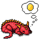
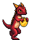

### Are You the Best Kobold?


https://www.areyouthebestkobold.com

This website is a small side project showcasing full-stack development. It utilizes React for the frontend, Flask (Python) for the backend, Websockets, and Google Cloud Platform.
The idea is pretty simple -- as a Kobold, can you contribute the most amount of gold to the Dragon Hoard?
When a gold coin is added by a user, a websocket broadcast is sent out to show that user's real-time contribution to all other current users. Try it!

**PASSWORDS CANNOT BE RECOVERED, AND ARE IMMEDIATELY ENCRYPTED USING BCRYPT AND NEVER SENT IN RAW FORMAT**

**NOT EVEN I WANT ACCESS TO YOUR PASSWORD!**



## Building the Project

To build the project, follow these steps:

1. CLONE THE REPOSITORY

```git clone https://Todd-C-Goldfarb/areyouthebestkobold.git```

2. GET THE LATEST PIP AND NPM

```npm install npm@latest -g```
```pip install --upgrade pip```

3. INSTALL REQUIRED DEPENDENCIES (According to the requirements.txt)

```pip install -r requirements.txt```

4. START LOCAL SITE

```npm start```

5. RUN BUILD (if needed)

```npm run build```



## To-Do (At Some Point)
- Migrate the environment to Python 3.11, as GAE Flex is going to deprecate <3.11.
- Optimize the site for mobile layouts.
- Account Kobold Customization
- Highlight/Showcase the #1 Kobold
- Add a throwing animation and more statistics.
- Add a mechanic related to (stealing from the hoard?)
- Add a github action to immediately deploy to GAE flex after main update
